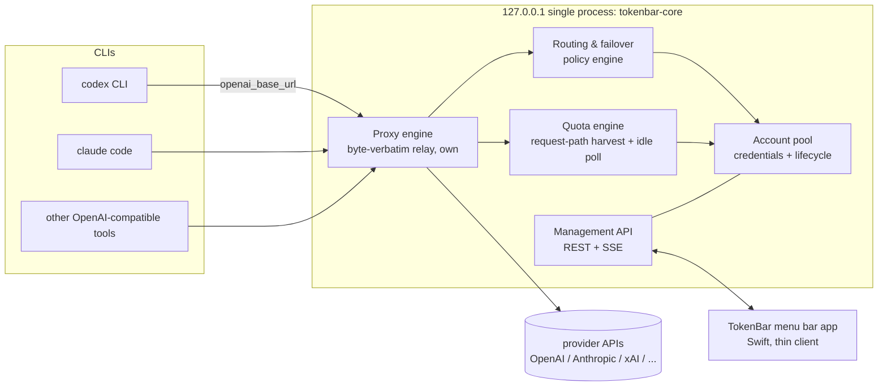
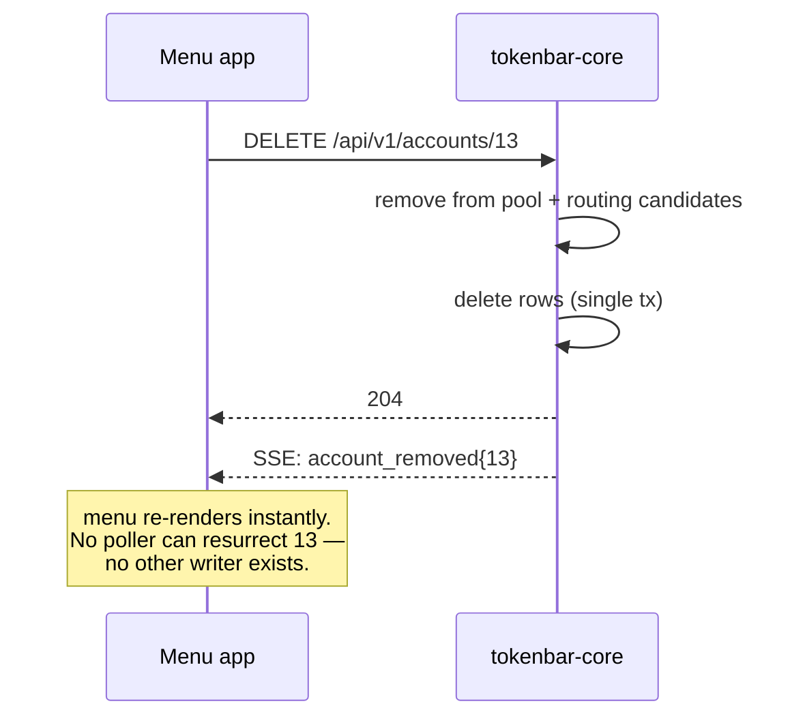
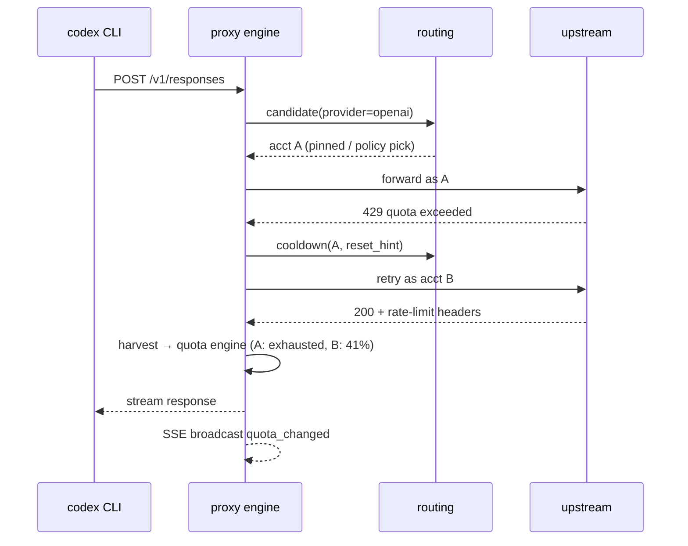

# TokenBar v2 — proxy-in-the-loop architecture

Date: 2026-08-01
Status: approved direction (open questions resolved 2026-08-01)
Supersedes: the v1 observer architecture (poller daemons + status.json rendezvous)
References: cc-switch (switch UX), opencodex (request-path quota), CLIProxyAPI (embeddable proxy core)
Plan: `docs/superpowers/plans/2026-08-01-tokenbar-v2-refactor.md`
(executable companion: phases P/M0–M4, exit criteria, test strategy)

## 0. Locked decisions (2026-08-01)

| # | Question | Decision |
|---|---|---|
| Q1 | Core lifetime | **launchd agent**, plist generated/installed by the menu bar app on install — CLIs keep working when the app is quit |
| Q2 | Cloudflare cloud push | **Dropped** — no export subscriber in v2 |
| Q3 | Window-history dashboard | **Folded into the browser panel** served by the core; standalone generated HTML is retired |

## 1. Why a rewrite

v1 is an *observer*: four processes (poller, heartbeat, CLI invocations,
server) all write `pool.db` and regenerate `status.json`, and the menu bar
re-reads that file every 30 s. Every structural bug we have hit — the
delete-resurrection race, `FOREIGN KEY constraint failed` from polling a
deleted account, the empty `~/solo/token-status-bar` shadow DB, swap's
auth.json rewrite rails — comes from two decisions:

1. State is acquired by *polling accounts from the outside*, and
2. Switching is done by *rewriting local CLI credential files*.

cc-switch, opencodex, and CLIProxyAPI all avoid both: they sit **in the
request path**, so usage state is a byproduct of traffic and switching is
an in-memory routing decision. v2 adopts that posture.

## 2. Goals / non-goals

**Goals**

1. **Single writer, single owner.** Exactly one process owns account
   state, quota state, and routing decisions. All mutation is an API call
   into it.
2. **Request-path telemetry.** Quota/usage data is harvested from real
   traffic. Background polling exists only as a best-effort filler for
   idle accounts.
3. **Switching without file surgery.** Account selection is a routing
   table change. `~/.codex/auth.json` and friends are never rewritten.
4. **Thin clients.** The macOS menu bar app renders state and issues
   commands over loopback HTTP/SSE. It holds no logic worth testing.
5. **Single-binary distribution.** One Go binary embeds the proxy core;
   the `.app` bundles it. No separate daemon installs, no launchd plist
   drift.

**Non-goals**

- Cross-protocol translation — our CLIs speak their providers' native
  protocols, so the proxy is a byte-verbatim pipe (§13.1).
- Multi-user / remote access. Loopback single-user, same threat model as
  v1's server.py.
- Cloud dashboard (kept as an export sink, unchanged concept).

## 3. System context



## 4. Process topology

One Go binary, `tokenbar-core`, three internal servers on one loopback
port (default `127.0.0.1:9417`):

| Surface | Path prefix | Consumers |
|---|---|---|
| Proxy | `/v1/...`, `/anthropic/...` | AI CLIs via env/config base URL |
| Management API | `/api/v1/...` | menu bar app, `tokenbar` CLI, browser panel |
| Event stream | `/api/v1/events` (SSE) | menu bar app (instant menu updates) |

Process ownership rules:

- Only `tokenbar-core` opens the SQLite DB. WAL is retained but no other
  process ever connects — the flock/`work_queue` layer is deleted.
- `tokenbar-core` runs as a launchd agent OR as a child of the menu bar
  app; either way the app talks to it exclusively over the API. The
  `.app` bundle carries the binary so a fresh machine works with zero
  setup.
- `status.json` as an inter-process rendezvous is **deleted**.
  `GET /api/v1/state` (same shape, plus `schema_version`) remains as a
  diagnostic snapshot; cloud push was dropped (Q2) and the history
  dashboard is folded into the panel (Q3).

## 5. Module breakdown

### 5.1 Proxy engine (own — revised by §13)

**Superseded by §13.1–13.3.** The risk-minimization review dropped the
vendored translation/executor layer entirely: our CLIs speak their
providers' native protocols, so the proxy is an own-built byte-verbatim
relay + auth injection + read-only tap. No upstream runtime dependency.

### 5.2 Account pool (own)

- Credential records: provider, identity (email/upstream account id),
  tokens, expiry, plan, labels, disabled flag.
- Storage: `accounts` + `tokens` tables (schema carried over from v1),
  plus a **cliproxy auth-dir importer** so existing
  `~/.cli-proxy-api/*.json` accounts migrate in one pass.
- Lifecycle: add (OAuth/device/API-key flows, ported to Go from the v1
  adapters per §13.1 S3), remove, reconnect, disable. All serialized
  inside the daemon — delete is a single
  `DELETE /api/v1/accounts/{id}` that cannot race anything.

### 5.3 Routing & failover (own — this is the product core)

Per provider, an ordered candidate list + policy:

- `pin` — manual "use this account" (replaces v1 swap engine entirely)
- `fill-first` — stay on one account until it cools down
- `round-robin` — spread load
- `session-affinity` — sticky per CLI session id

Failover: on upstream 429 / quota-exceeded, the credential enters
cooldown (provider-specific TTL from reset hints) and the request is
retried on the next candidate. No cooldown → no blackout windows.

### 5.4 Quota engine (own)

Two sources, one model:

1. **Harvest (primary):** response headers/payloads flowing through the
   proxy update per-account window state (`used_pct`, reset times,
   plan) as a byproduct. Zero extra API calls.
2. **Idle poll (secondary):** accounts with no traffic for N minutes
   get a lightweight usage probe so the menu never shows week-old
   numbers. Cadence is governed by S22 (≥ 15 min, ±20% jitter,
   serialized) — v1's 60 s hot cadence and pre-reset capture are
   deliberately dropped as enforcement-risky (§14).

The window model (timed windows, drop windows, reset credits, lifecycle
events) is ported from v1 `window_history.py`/`status.py` semantics —
that modeling is v1's real intellectual property and stays.

### 5.5 Management API (own)

REST + SSE, loopback only, bearer token in `~/.tokenbar/admin-token`
(0600), same pattern as opencodex's `admin-api-token`.

| Endpoint | Purpose |
|---|---|
| `GET /api/v1/state` | full payload (menu render, panel, diagnostics) |
| `GET /api/v1/events` | SSE: account/quota/routing changes, pushed on mutation |
| `POST /api/v1/accounts` | start add flow (OAuth/device/api-key) |
| `DELETE /api/v1/accounts/{id}` | remove — immediate, serialized |
| `POST /api/v1/accounts/{id}/reconnect` | re-auth in place |
| `POST /api/v1/routing/{provider}/pin` | manual account selection |
| `GET /api/v1/providers` | provider catalog + capabilities |

### 5.6 Clients

- **Menu bar app (Swift):** keeps v1's UI layer (rows, gauges, reset
  credits, usable-first layout) but `StatusLoader` becomes an API
  client: initial `GET /state`, then SSE for updates; actions become
  POSTs. The 30 s timer, subprocess spawning, and env-var path plumbing
  are deleted.
- **Browser panel:** served by the core, talks to the same API.
- **CLI (`tokenbar` binary alias):** thin API client for scripts.

## 6. Data model

SQLite at `~/.tokenbar/pool.db`, opened by the core only:

- `accounts`, `tokens` — carried over (schema_version stamped)
- `quota_windows` — latest per-account window state (replaces
  append-only `limit_snapshots` as the read path; snapshots retained
  for history charts)
- `routing` — per-provider policy + pinned account
- `cooldowns` — credential, reason, until
- `lifecycle_events`, `refresh_log`, `window_history` — unchanged

Config: `~/.tokenbar/config.yaml` (port, policies, poll cadence).
One home dir env (`TOKENBAR_HOME`) replaces the five v1 `AGENT_POOL_*`
vars; missing DB at startup is a loud error with a repair hint, never
silent auto-create.

## 7. Key flows

### 7.1 Delete account (the bug that started this)



### 7.2 Request with failover



### 7.3 Add account

`POST /api/v1/accounts` → core runs the provider's OAuth/device flow
(v1 adapter code), saves credentials, immediately probes quota, SSE
broadcasts. The CLI needs no config change — the account is already
routable.

## 8. Technology choices

| Layer | Choice | Why |
|---|---|---|
| Core language | Go 1.2x | single static binary; goroutines fit relay+pollers; stdlib `httputil.ReverseProxy`-grade HTTP is sufficient for a dumb pipe |
| Proxy | own byte-verbatim relay (§13) | no translation needed; zero upstream runtime deps |
| Store | SQLite (modernc.org/sqlite, pure Go) | carry v1 schema; no cgo |
| Credentials at rest | macOS Keychain (§13.5 S16) | core holds every token |
| Menu bar | Swift/AppKit (existing UI code) | v1 UI is the asset worth keeping |
| IPC | loopback HTTP + SSE, bearer token | already proven by v1 server.py |
| Packaging | `.app` embeds core binary; launchd plist generated by app | kills plist drift |

## 9. Migration from v1

| Phase | Deliverable | Exit criteria |
|---|---|---|
| M0 spike | Go skeleton: byte-verbatim relay for one provider + auth injection; auth-dir import of `~/.cli-proxy-api` | one real codex request relayed through the binary, stream intact |
| M1 pool + routing | account CRUD API, pin/fill-first, cooldown | delete/add/pin via API; unit tests for the v1 race scenarios |
| M2 quota engine | header harvest for openai/anthropic; idle poll for the rest | menu-grade state without any v1 daemon running |
| M3 menu client | Swift app on `/state` + SSE; delete/swap/reconnect via API | v1 poller/heartbeat/status.json all disabled; menu live |
| M4 cutover | v1 backend retired to `legacy/`; launchd rewritten by app; DB migration script | one binary, one plist, one DB |

v1 keeps running until M3 — the core can read v1's DB read-only for
history import.

## 10. Risk register

Likelihood (L) and impact (I): low / med / high. Every risk lists its
detection signal, the mitigation built into the design, and the
contingency when the mitigation fails.

### 10.1 Proxy correctness — the new top-tier risk class

v1 was an observer: its worst bug showed stale numbers. v2 sits in the
request path: its worst bug breaks the user's CLI session. These risks
are why M0 is a soak test, not a demo.

**R1. Streaming desync / truncated SSE streams** — *residual: low (§13.6)*
The proxy re-emits provider SSE; a buffering or flush bug corrupts
streams mid-response and the CLI sees cut-off or garbled output.
L: med → low under S1 byte-verbatim relay, I: high.
Detection: CLI-side errors, truncated generations, soak-test corpus.
Mitigation: end-to-end pass-through streaming (no re-serialization of
chunk payloads where avoidable), flush per chunk, byte-for-byte relay
tests against recorded provider streams.
Contingency: per-provider "direct mode" bypass flag; global kill-switch
(repoint CLI base URL).

**R2. Protocol translation drift** — *eliminated (§13.1 S2–S3: no
translation layer)*
~~Providers change schemas; translator lags~~. v2 relays each provider's
native protocol byte-verbatim, so there is no translator to drift.
Native-protocol evolution is absorbed by R4's harvest-parsing tests
(display-side only).

**R3. Failover mid-session breaks conversation state**
Account A dies mid-conversation; retry on account B loses
provider-side session affinity (cached prefixes, conversation
handles), causing quality regressions or hard errors.
L: med, I: med.
Detection: user reports, elevated retry-then-error rate.
Mitigation: session-affinity policy as default for interactive CLIs;
failover only on hard quota/auth errors, never on timeouts alone;
transparent single retry, never chained retries across 3+ accounts.
Contingency: policy `pin` makes failover fully manual again.

**R4. Wrong quota model → wrong routing decisions**
Harvested window state is misread (e.g., reset-time parsing), so the
router sends traffic to an exhausted account or cools down a healthy
one.
L: med, I: med.
Detection: routing-decision log vs. actual upstream 429s divergence;
menu numbers disagreeing with provider dashboard.
Mitigation: v1's window model is ported with its test corpus; harvest
is advisory — a real upstream 429 always wins over the model.
Contingency: config flag to run harvest in observe-only mode (log,
don't route on it).

### 10.2 Security

**R5. Credential store compromise**
The core holds every OAuth token for every provider — a single file
read exfiltrates all of them.
L: low (loopback, single-user), I: high.
Mitigation: `~/.tokenbar` 0700, DB 0600, tokens never in logs
(scrubbed at the logging layer), bearer token for the management API
in a 0600 file; keychain-backed encryption of token fields as a
follow-up milestone.
Contingency: one-command `tokenbar revoke-all` hitting each provider's
revocation endpoint; documented in the runbook.

**R6. Management API accessed by other local processes**
Anything on loopback can call the API (same threat model as v1 and
opencodex — accepted), but a malicious local process could delete
accounts or read quota data.
L: low, I: med.
Mitigation: bearer token required on every `/api` route; proxy routes
unauthenticated only for CLI traffic and bound to 127.0.0.1 only.
Note: the token means a malicious local process can still read it —
this is inherent to local CLIs; accepted consciously.

**R7. Secret leakage into logs / SSE / /state export**
Payload builders accidentally include access tokens in the state
snapshot or SSE deltas, and the browser panel or menu renders them.
L: med, I: high.
Mitigation: payload schema has an allowlist of fields (deny-by-default
serialization); test asserts no field matches token patterns in any
emitted payload.

**R8. Upstream request smuggling via the proxy**
A crafted CLI request makes the core call unintended endpoints with
pool credentials (SSRF-shaped).
L: low, I: high.
Mitigation: upstream allowlist per provider — the executor only ever
dials the provider's fixed base URLs, never a client-supplied URL.

### 10.3 Availability

**R9. Core down ⇒ all CLIs down (new blast radius)**
In v1 a dead backend meant a stale menu. In v2 a dead core means codex
/ claude can't reach their providers.
L: med, I: high.
Mitigation: launchd `KeepAlive` + `ThrottleInterval=10`; watchdog
backoff after 3 crashes/60 s; menu surfaces core-down state
prominently with a one-click "restore direct mode" helper.
Contingency: documented 30-second manual recovery (comment out base
URL); M4 ships `tokenbar doctor` that does it automatically.

**R10. Port conflicts**
9417 (or 9416 pprof) collides with another local service after an OS
update or new tool install.
L: low, I: med.
Mitigation: port from config, not hardcoded; core fails loudly at bind
with the conflicting PID in the message; health endpoint includes the
port so clients discover rather than assume.

**R11. SQLite corruption (single writer, but still)**
Power loss mid-write, or a forced kill during VACUUM.
L: low, I: high (it is the only state store).
Mitigation: WAL + `synchronous=NORMAL`; VACUUM into a new file then
atomic swap; nightly backup of `pool.db` (plain copy while WAL is
checkpointed) with 7-day retention.
Contingency: restore from latest backup; worst case re-add accounts —
credentials re-onboard in minutes, history is the only real loss.

**R12. OAuth flows rot**
Providers change login pages/scopes; add/reconnect stops working for
one provider.
L: high over time, I: med.
Mitigation: flows ported per-provider behind one API so a broken
provider degrades alone; device-code fallback where the provider
offers one; upstream cliproxy login flows as reference
implementations to crib fixes from.

### 10.4 Resource (summary — full treatment in §12)

**R13. Goroutine/memory leak in long-running core** — L: med, I: med.
The 15-day-flat cliproxyapi measurement is evidence but not proof for
*our* wrapper code. goleak in CI, GOMEMLIMIT, pprof endpoint, RSS
budget alarm on `/health`.

**R14. CPU spin from scheduler or reconnect loops** — L: low, I: low.
Single scheduler goroutine, jittered backoff on every retry path,
launchd throttle.

### 10.5 Migration

**R15. Dual-run divergence during M1–M3**
v1 daemons and v2 core both live; they disagree about state and the
menu shows whichever loaded last — the v1 status.json race in a new
costume.
L: high if unmanaged, I: med.
Mitigation: v2 reads v1's DB read-only; v1 daemons are paused per
provider as v2 harvest covers that provider (flag per provider, not a
big-bang cutover).

**R16. Auth import mismatch**
`~/.cli-proxy-api` JSON or v1 `pool.db` rows import with wrong
identity mapping (email vs upstream account id), so routing pins the
wrong account.
L: med, I: med.
Mitigation: import is dry-run by default, prints the mapping table,
requires explicit confirm; identity keyed on upstream account id
(never email) as v1's swap engine already learned the hard way.

**R17. Rollback complexity**
User wants v1 back after M4.
L: low, I: med.
Mitigation: v1 backend moves to `legacy/` unmodified; rollback =
repoint CLI base URL back to direct + relaunch v1 daemons; the v1 DB
is untouched by v2 (separate `~/.tokenbar/pool.db`).

### 10.6 Dependency & maintenance

**R18. Vendored cliproxy divergence** — *eliminated (§13.1 S3: no
runtime dependency on upstream proxy code)*
OAuth flows are ported from our own v1 adapters; cliproxy remains only
a reference implementation to consult when providers change login.

**R19. Go↔Swift contract drift**
Two codebases, one API; payloads drift and the menu decodes garbage.
L: med, I: low.
Mitigation: golden-payload contract tests generated from the Go
schema, run in the Swift test suite; `schema_version` in every
payload, app refuses unknown majors loudly instead of half-decoding.

**R20. Bus factor / scope creep**
This is a proxy + pool + quota engine + menu app — easy to grow past
one maintainer's evenings.
L: med, I: high.
Mitigation: the phase gates in §9 are also scope fences — no provider
beyond v1's list, no translation layer ever (§13.1), no new
surface (mobile app, cloud) until M4 is done and stable for a month.

### 10.7 Accepted risks (consciously not mitigated)

| Risk | Why accepted |
|---|---|
| Local processes can read the bearer token | inherent to local CLI tooling; same model as opencodex/v1 |
| Idle-poll numbers lag real usage by up to one poll interval | harvest covers active accounts; idle staleness is cosmetic |

Provider TOS / account-blocking risk is **not** in this table — it gets
its own treatment in §14.

## 14. Provider enforcement & account-safety analysis

Providers warn that running agent traffic through third-party harnesses
can get accounts blocked. This section maps every observable they can
enforce on, scores our exposure, and turns the answers into normative
constraints (S17–S26). The design stance: **we evade nothing — we make
the marginal signal of our existence as small and as honest as
possible.** cliproxyapi's config options (`claude-cloak`,
`identity-confuse`) prove enforcement is real; they are also exactly
the kind of anti-detection behavior we refuse to implement.

### 14.1 The five observation planes

Whatever we do, a provider can observe:

1. **Transport** — TLS ClientHello (JA3/JA4), HTTP/2 settings, header
   order/casing of the *client library* (Go `crypto/tls` ≠ codex CLI's
   stack ≠ Claude Code's undici). A proxy changes the transport even
   when it changes nothing else.
2. **Request metadata** — User-Agent, `originator`, session/conversation
   ids, device-id headers, `ChatGPT-Account-Id`, beta flags.
3. **Behavioral shape** — request cadence (metronome polling), endpoint
   mix (usage-endpoint hits no human CLI makes), parallel fan-out,
   24/7 activity, bot-like prompts (keep-alive "hi").
4. **Identity continuity** — one IP/device touching N accounts;
   account A's conversation suddenly continuing as account B;
   token refreshed by client X but used by client Y.
5. **Fleet correlation** — many accounts doing the same unusual thing
   at the same time (mass refresh, mass poll) is the strongest
   "this is a pool, not a person" signal.

### 14.2 v1's current exposure (honest baseline)

v1 already emits several self-identifying signals, *without* proxying:

- `heartbeat.py` sends `"Reply with exactly... hi"` every 5 h per
  account via pool OAuth tokens — automated, content-free traffic, the
  single most bot-like signal we produce.
- The poller hits `wham/usage` etc. every 5 min per account with
  `User-Agent: agent-pool/1.0` — a metronome + a self-identifying UA.
- OAuth login flows spoof a Chrome browser UA (standard practice, but
  still a spoof).
- Mass token refresh across the fleet on schedule (plane 5).

So the enforcement question is not new for us; v2's job is to make the
posture *better*, not merely not-worse.

### 14.3 Detection-vector register for v2

| # | Vector | Plane | Our exposure | Design answer |
|---|---|---|---|---|
| E1 | Proxy TLS fingerprint differs from official CLI | transport | **unavoidable** when proxying | accept + monitor; observe-only mode for the cautious; mimicry explicitly rejected (S18) |
| E2 | Proxy-tell headers (`X-Forwarded-For`, `Via`) | metadata | introduced by naive relays (Go's `httputil.ReverseProxy` adds XFF by default) | S17 verbatim pass-through, custom relay |
| E3 | Altered/added client headers, UA mismatch | metadata | only if we touch them | S17: replace `Authorization` value only |
| E4 | Cloaking / identity-confuse / system-prompt injection | metadata | zero — we refuse to build it | S18 MUST NOT |
| E5 | Mid-conversation account failover | continuity | real in naive failover | S19: continuity markers disable failover |
| E6 | Account rotation from one IP/device | continuity | inherent to pooling, but identical to a human with N accounts using official CLIs on one machine | S9 pin-by-default + S24 rotation only on hard rejection |
| E7 | Keep-alive "hi" heartbeat | behavioral | v1 emits it today | **S20: removed in v2** |
| E8 | Metronome usage-endpoint polling | behavioral | v1: 5 min flat cadence | S22: ≥15 min, ±20% jitter, serialized, skip harvest-covered accounts |
| E9 | Fleet-synchronized refresh/poll | fleet | v1 does this | S21 refresh-on-use only; S26 serial human-paced management ops |
| E10 | Same account used via CLI and proxy concurrently | continuity | possible | documented; pin makes the proxy the single path |
| E11 | Token refreshed by our client, used by official CLI | continuity | only in observe-only mode | refresh-on-use keeps refresh and use on the same path |

### 14.4 Normative constraints

**S17. Verbatim pass-through.** The relay MUST forward every client
header unchanged — UA, `originator`, session/device ids, beta flags —
and MUST NOT add `X-Forwarded-For`, `Via`, `Forwarded`, or any
proxy-identifying header. The only mutation allowed is replacing the
`Authorization` *value* with the routed account's token (and the
provider account-id header that pairs with it). A custom relay is
required; Go's `httputil.ReverseProxy` default behavior (appends XFF)
violates this clause.

**S18. No evasion, ever.** The core MUST NOT implement cloaking,
UA/identity spoofing, system-prompt injection or replacement, TLS
fingerprint mimicry (uTLS-style), or request "identity confusion".
If a provider can detect us, the answer is honesty + minimization,
not disguise. (This is a values decision and a practical one: evasion
is what turns soft enforcement into bans.)

**S19. No mid-conversation failover.** If a request carries continuity
markers (`previous_response_id`, conversation/session ids, Claude
session metadata), the core MUST NOT retry it on a different account.
The upstream error is returned verbatim; the user starts a fresh
session on the new account. Failover (S7–S9) applies only to
session-initial requests.

**S20. Heartbeat is removed.** v2 ships no keep-alive prompt traffic.
If a future need arises it requires an explicit opt-in flag with a
warning, default off.

**S21. Refresh-on-use.** Token refresh happens only when a request
for that account is being routed and the token is near expiry —
never as a scheduled fleet sweep. (Also deletes v1's refresh flock.)

**S22. Human-shaped idle polling.** Idle-poll interval ≥ 15 min with
±20% jitter; strictly serialized per provider; skipped for accounts
with recent request-path harvest; exponential backoff on any 429;
requests use the official client's own endpoint shapes (these are the
same calls the official CLI itself makes).

**S23. Per-provider modes.** Each provider is independently
`proxy` / `observe-only` / `disabled`. Observe-only keeps the menu
alive from idle polls while the CLI talks to the provider directly —
zero marginal transport signal for that provider.

**S24. One active account per provider.** Rotation happens only on a
hard upstream rejection (S7), never round-robin per request. From the
provider's view, each account behaves like one consistent user.

**S25. Global observer mode.** One config flag returns the whole
system to v1 posture (no proxying anywhere) — the instant-retreat
path if enforcement winds change.

**S26. Human-paced management.** Account add/remove/reconnect/pin
operations execute serially, never fanned out in parallel.

### 14.5 Provider notes

| Provider | Specific signals | Posture |
|---|---|---|
| OpenAI (codex) | `originator`, `ChatGPT-Account-Id`, session ids, `localhost` JWT claim; Responses continuity via `previous_response_id` | proxy with S17/S19; S19 is load-bearing here |
| Anthropic (claude) | OAuth tokens licensed to Claude Code; system-prompt shape is checked by harnesses (cliproxy cloaks for a reason) | proxy only genuine Claude Code traffic, verbatim; anything non-Claude-Code → observe-only |
| GitHub Copilot | editor/plugin version headers | observe-only by default — its official clients are editors, not CLIs |
| API-key providers (xai, devin, kimi) | keys are issued for arbitrary clients | proxy freely; enforcement pressure low |

### 14.6 The honest residual

Even a perfect byte-verbatim relay changes the TLS transport, and
pooling multiple accounts on one machine is observable no matter how
careful we are. What S17–S26 buy us: no spoofing evidence, no
bot-shaped traffic, no continuity anomalies, and an instant retreat
(S25). What they cannot buy: a guarantee. The user chooses per
provider (S23) with full information — and for any provider where a
ban would be catastrophic, observe-only is the correct mode.

## 15. Spec ↔ implementation alignment (final audit, 2026-08-01)

Closing pass over everything written above against what actually
exists — the v1 codebase, and this machine's running state.

### 15.1 Doc-internal reconciliations applied in this pass

| Location | Was | Now |
|---|---|---|
| §4 | status.json export "kept for cloud push and dashboard" | contradicts Q2/Q3 → diagnostic snapshot only |
| §5.4 | idle poll "hot 60 s / base 5 min" | contradicts S22 → S22 governs; 60 s cadence + pre-reset capture dropped as enforcement-risky |
| §12.3 | same stale cadence claim | aligned to S22 |
| §5.2 | OAuth flows "reused from v1 adapters" | clarified: ported to Go per S3 |

### 15.2 v1 behaviors that violate v2 normative clauses

| v1 behavior (verified in code) | Violates | Disposition |
|---|---|---|
| `heartbeat.py` sends "hi" every 5 h per account; launchd agent `com.tonye.agentpool-heartbeat` live | S20 | **retire now** — highest ban-signal per line of code; does not need to wait for v2 |
| Poller: 5-min metronome, `User-Agent: agent-pool/1.0` on usage endpoints | S22, S17-spirit | retire with v1 (M4); cadence floor applies to v2 idle poll |
| Scheduled fleet token refresh (work_queue flock) | S21 | retire with v1; v2 refreshes on-use |
| 4 writers to `pool.db` + `status.json` (poller, heartbeat, CLI, server) | §2 single-writer | superseded by M1 core |
| Swift app polls `status.json` every 30 s | §5.6 push model | superseded by M3 SSE client |
| `cmd_remove` flock patch (2026-08-01, uncommitted) | not in spec — v1 stopgap | **commit as v1 safety patch**; v2 deletes the flock layer |
| `StatusLoader` `AGENT_POOL_HISTORY_DIR` patch (uncommitted) | §6 single-home direction | commit with the above; v2 replaces all five env vars with `TOKENBAR_HOME` |
| Tokens plaintext in SQLite | S16 | M2 keychain; documented as accepted until then |
| `server.py` has REST but no SSE, no bearer auth | §5.5, S14 | partial; v2 adds both |
| OAuth login spoofs a Chrome UA (`providers/claude.py`) | S18 letter | **documented exception**: browser-based OAuth flows present a browser because they *are* a browser flow; not request-path evasion. No change |

### 15.3 Machine/operations state divergences

**Resolved 2026-08-01 (Phase P).** The inventory below was executed;
findings and dispositions:

1. **Who writes what (was "undetermined").** The poller
   (`com.tonye.agentpool-poller`) and heartbeat processes were started
   2026-07-22 from `~/solo/token-status-bar/backend/pool.py`. That
   directory was later renamed to `~/solo/token-bar`, so the plist
   paths dangle, but the processes survived on deleted code with their
   DB file descriptors pointing — by inode — at the **repo**
   `secrets/pool.db` (52 MB, 9 accounts). The poller regenerated
   `~/solo/token-status-bar/secrets/status.json` every 5 min from that
   repo DB (its `AGENT_POOL_STATUS_JSON` still named the old path).
   The shadow `pool.db` there (4 KB) is opened only by the app's
   bundled server (`pool.py server`, port 7817). Cloud push
   (PID from `com.tonye.tokenbar-cloudpush`) read the shadow
   status.json.
2. **Canonical v1 data dir: repo `secrets/`.** It holds the only real
   DB. The shadow dir remains the menu app's read rendezvous
   (status.json + history) until M3 replaces file polling with the
   API; no process may treat the shadow `pool.db` as data.
3. **Retired plists (2026-08-01):** `com.tonye.agentpool-heartbeat`
   (booted out + plist removed — S20: the 5-hourly "hi" traffic is
   permanently off) and `com.tonye.tokenbar-cloudpush` (booted out +
   plist removed — Q2). Both preserved in
   `secrets/recovery/2026-08-01/`.
4. **Poller plist repaired in place:** ProgramArguments now point at
   `~/solo/token-bar/backend/pool.py poll-loop` with
   `AGENT_POOL_DB=~/solo/token-bar/secrets/pool.db` and
   `AGENT_POOL_STATUS_JSON=~/solo/token-status-bar/secrets/status.json`
   (preserving the menu rendezvous). Verified: fresh status.json with
   9 accounts within one poll cycle. The old deleted-code process was
   booted out.
5. **Backups (P5):** WAL-checkpointed `pool.db`, repo + shadow
   status.json, and all three plists (plus `.bak-pre-live` copies)
   archived in `secrets/recovery/2026-08-01/`.

Original pre-cleanup observations (kept for the record):

Reality on this machine does not match the clean slate the migration
phases assume. Inventory and cleanup is a **prerequisite to M1**, not a
side task:

1. **Split-brain data dirs.** Real data lives in the repo `secrets/`
   (52 MB DB, 9 accounts); the app's default `poolDir`
   `~/solo/token-status-bar` holds an empty shadow DB + a *fresh*
   status.json (some live process writes it with repo-DB data). Which
   process, with which env, is undetermined.
2. **Broken launchd entries.** `com.tonye.agentpool-poller` and
   `-heartbeat` plists point `ProgramArguments` at
   `~/solo/token-status-bar/backend/pool.py`, which **does not exist**,
   yet `poller.log` receives fresh writes — a poller runs from an
   unknown location. `.bak-pre-live` plist copies suggest past surgery.
3. **Cloud push still running** (`com.tonye.tokenbar-cloudpush`,
   KeepAlive) despite Q2 — retire at cutover; note it reads the
   *other* status.json (`~/solo/token-status-bar/...`), not the repo's.
4. **v1 safety patches uncommitted** (cmd_remove lock, HISTORY_DIR) —
   commit before any v2 branch work so the v1 baseline is reproducible.
5. Running set verified 2026-08-01: TokenStatusBar.app (78 MB) +
   bundled python server (43 MB, port 7817) + the unknown poller.

### 15.4 Feature traceability matrix

| Spec element | Clause | Current artifact | Status | Lands in |
|---|---|---|---|---|
| Single-writer core | §2, §13 | `core/internal/state` + `pool` + `api` | done (M1) | M1 |
| Byte-verbatim relay | S1–S6 | `core/internal/relay` | done (M0) | M0 |
| Verbatim headers / no XFF | S17 | `core/internal/relay` (test-covered) | done (M0) | M0 |
| No-cloak guarantee | S18 | v1 clean except documented login exception | held | standing rule |
| Continuity-aware failover | S19 | `core/internal/relay/routed.go` (test-covered) | done (M1) | M1 |
| Heartbeat removal | S20 | daemon retired 2026-08-01 (Phase P) | done | **immediate v1 patch** |
| Refresh-on-use | S21 | `core/internal/auth` (singleflight, 80% TTL) | done (M2) | M2 |
| Human-shaped idle poll | S22 | `core/internal/idlepoll` (≥15 min, ±20% jitter, serialized) | done (M2) | M2 |
| Per-provider modes | S23 | none | missing | M3 |
| Pin-based switching | S24, S9 | `core/internal/routing` (pin default) | done (M1) | M1 |
| Observer-mode retreat | S25 | v1 *is* observer mode | exists de facto | M3 formalize |
| Human-paced management | S26 | CLI is serial | compliant | keep |
| Management API + SSE | §5.5 | REST + bearer done (M1); SSE pending | partial | M3 |
| Keychain at rest | S16 | `core/internal/vault` (login keychain, DB refs only) | done (M2) | M2 |
| `TOKENBAR_HOME` single dir | §6 | 5 env vars, 2 data dirs | violated | M4 + §15.3 cleanup |
| App-generated launchd plist | Q1 | hand-written, one broken | broken | M4 |
| Resource budgets + health | §12 | unmeasured (v1 ~180 MB total) | n/a | M3 acceptance |
| Golden contract tests | R19 | v1 menu goldens only | partial | extend to Go schema |

### 15.5 Maintenance policy during transition

1. **v1 gets safety patches only** — changes that reduce account-ban
   signal or data-loss risk (heartbeat removal, the delete-race lock).
   Everything else goes to v2 branches.
2. **The v1 safety patches are committed before M0 starts**, so any
   v2 experiment can be abandoned without losing them.
3. **No v1 feature work** (new providers, new menu features) once M0
   begins; that energy is what starves v2.
4. §15.3's inventory (who writes the shadow status.json, retiring
   broken plists, choosing the canonical data dir) is executed as the
   first M1 work item and its findings appended to this section.

## 11. Open questions

All resolved — see §0.

## 13. Risk-minimized core specification (normative)

This section re-specifies the core so the top risks in §10 are
*eliminated by construction*, not mitigated after the fact. Where it
conflicts with earlier sections, this section wins. Key words MUST /
MUST NOT / SHOULD are RFC-2119.

The minimization converges on three postures:

- **Dumb pipe** — the proxy relays bytes, never transforms them.
- **Advisory state** — modeled quota is display-only; only real
  upstream signals affect traffic.
- **Fail-open** — any core failure degrades to a direct provider
  connection (v1 behavior), never to an outage.

### 13.1 The big simplification: no translation layer

Risk review of R1/R2/R18 forced a question: why does the proxy parse
payloads at all? Our CLIs speak their providers' native protocols
(codex → OpenAI Responses, claude code → Anthropic). Cross-protocol
translation exists in cliproxy to serve *alien* clients — we have none.

Therefore:

**S1. The proxy MUST relay request and response bodies byte-verbatim.**
No parsing, re-serialization, schema mapping, or "normalization" on the
request path. (Eliminates R1 by construction; R2 becomes out of scope.)

**S2. Same-protocol forwarding only.** v2 MUST NOT include a
translation layer. A client that needs protocol B against provider A
is not a v2 use case.

**S3. Consequence — the vendored cliproxy translator/executor is
dropped.** What remains needed from upstream: nothing at runtime.
OAuth flows and token refresh are ported from our own v1 adapters
(already provider-correct). R18 (vendored drift) is eliminated, and
the core shrinks to: HTTP relay + auth injection + header tap +
routing table. The earlier §5.1 "Proxy engine (vendored)" is void.

### 13.2 Request-path budget (the whole hot path)

Everything the proxy may do per request, exhaustively:

1. pick candidate account from the routing table (atomic read),
2. inject/refresh that account's auth header,
3. dial the provider's fixed base URL (allowlist),
4. relay bytes both ways, flushing per chunk,
5. tee a read-only copy of headers (+ metered body bytes) to the
   harvest queue,
6. on a definitive quota/auth rejection, optionally one failover retry
   (see 13.3).

**S4. Harvest MUST be a tee, never a filter.** Observation happens on
already-transiting bytes, off the relay goroutine's critical path. A
harvest failure MUST be logged and dropped, never propagated.
(R4's routing impact eliminated; only display can be wrong.)

**S5. The proxy MUST NOT buffer** more than one in-flight chunk
(≤ 64 KB) per direction. Bodies stream end-to-end.

**S6. No locks shared with management/poll paths on the request
path.** Routing table updates apply by atomic swap (RCU-style);
harvest/cooldown writes go to a queue drained by one writer goroutine.
A stalled DB MUST NOT add latency to relayed requests. (R11 reduced
to data-loss-only, never availability.)

### 13.3 Conservative failover

**S7. Failover MUST trigger only on definitive signals**: HTTP 429 with
quota semantics, or 401/403 auth rejection — never on timeouts, 5xx,
or network errors (those return to the CLI exactly as upstream sent
them).

**S8. At most one failover retry per request.** No chained retries
across 3+ accounts.

**S9. Default policy for interactive CLIs is `pin`.** Automatic
failover is opt-in per provider. (R3 residual: with pin-by-default,
mid-session account change happens only when the user asked for it.)

**S10. Cooldowns derive only from real upstream rejections**, TTL from
the provider's own reset hints — never from modeled quota.

### 13.4 Fail-open availability

**S11. Ship a CLI shim.** `tokenbar` wraps CLI launches: it
health-checks the core (< 100 ms) and points the CLI at the core only
when healthy; otherwise it launches against the provider direct URL.
This is the default way CLIs start, so a dead core is invisible to
work. (R9's blast radius collapses to "the shim's health check lies",
which the next clause bounds.)

**S12. Cold start < 1 s to first proxied request.** Migrations and
history import run async *after* the listener is up. The proxy must
serve before the DB is even open (routing table loads lazily;
first-request latency may pay one DB read).

**S13. Automatic direct mode.** After 3 core crashes in 60 s, the
watchdog rewrites CLI configs back to direct endpoints and notifies
the menu. The kill-switch is a mechanism, not a runbook entry.

### 13.5 Security minimums

**S14.** Bind 127.0.0.1 only; bearer token on every `/api` route;
upstream dial allowlist (fixed provider base URLs only). (R6, R8)

**S15.** Deny-by-default payload schema; CI scans every emitted
payload (`/state`, SSE, logs) for token-shaped strings. (R7)

**S16.** Tokens encrypted at rest via macOS Keychain — promoted from
"follow-up" to an M2 requirement, because the core holds every
credential. (R5)

### 13.6 Residual risk after minimization

| Risk | Before | Structural change | Residual |
|---|---|---|---|
| R1 stream corruption | high-class | byte-verbatim relay (S1) | **low** — plain HTTP relay bugs only |
| R2 translation drift | med-high | no translation layer (S2, S3) | **none** — out of scope |
| R3 mid-session failover | med | pin default, single retry, hard signals only (S7–S9) | **low** |
| R4 wrong quota model | med | display-only, tee harvest (S4, S10) | **cosmetic** |
| R5 credential theft | — | keychain encryption at rest (S16) | **low** |
| R9 core down = CLIs down | high-class | shim fallback + auto direct mode (S11–S13) | **low** |
| R11 DB corruption | med | off-hot-path writes + backups (S6) | **data-loss only** |
| R18 vendored drift | med | vendoring dropped (S3) | **none** |
| R15 dual-run divergence | med | unchanged (migration-phase only) | med, time-bounded |
| R12 OAuth rot | high over time | unchanged — flows ported per provider | med |

### 13.7 What the core becomes

After minimization the core is four small things:

```
relay      ~ HTTP reverse proxy, byte-verbatim, fixed upstreams
auth vault ~ OAuth login/refresh per provider (ported v1 adapters), keychain at rest
harvest    ~ header/body tap → quota model (display-only)
control    ~ routing table (pin/failover) + management API + SSE
```

Each is independently testable, none imports upstream proxy code, and
the request path (relay + auth header + tap) is the only part that can
affect a user's CLI — and it is intentionally dumb.

## 12. Resource budget & leak/CPU safeguards

### 12.1 Measured baselines (this machine, 2026-08-01)

| Process | RSS | CPU | Uptime |
|---|---|---|---|
| cliproxyapi (Go, the vendored core's origin) | 31 MB | ~0% | 15 d 20 h — **flat, no leak** |
| opencodex (bun) | 278 MB | 2.4% | 23 h — runtime-heavy; validates Go over JS |
| TokenStatusBar.app (Swift, v1 UI) | 78 MB | ~0% | 46 min |
| v1 bundled python server | 43 MB | ~0% | 46 min |
| v1 total (app + server + poller + heartbeat) | ~180 MB across 4 processes | | |

**M0 relay measurements (2026-08-01, `tokenbar-core` M0 spike):**

| State | RSS | CPU | vs §12.2 budget |
|---|---|---|---|
| Idle | 10.5 MB | 0.0% | 17% of the 60 MB idle budget (83% headroom) |
| After 100 sequential streams (mixed streaming / non-streaming / abort-mid-stream) | 12.4 MB | 0.0% | 8% of the 150 MB p95 budget (92% headroom) |

Byte-diff direct-vs-proxied clean (hop-by-hop + Date excluded
explicitly); goleak clean on the streaming suite; live codex CLI turn
completed through the relay. One deviation found: codex CLI 0.146
attempts a WebSocket transport first; the dumb pipe answers 405 and
the CLI falls back to HTTP SSE after ~10 s of retries. HTTP SSE is
the relay's contract; the WS path is out of scope for v2 (S1).

The 15-day-flat Go proxy is the strongest evidence the v2 shape can run
leak-free; bun's 278 MB is why the core is Go, not a JS service.

### 12.2 Budgets (enforced in M3 acceptance tests)

| Component | Idle RSS | p95 under load | Idle CPU |
|---|---|---|---|
| tokenbar-core | ≤ 60 MB | ≤ 150 MB | ≈ 0% (timer-only) |
| Menu bar app | ≤ 100 MB | — | ≈ 0% (event-driven, no polling) |

`GOMEMLIMIT=256MiB` soft cap: forces GC before runaway instead of
letting the OOM killer decide.

### 12.3 Known leak/CPU vectors and the safeguard for each

| Vector | Safeguard |
|---|---|
| **Goroutine leak from abandoned streams** (CLI disconnects mid-response) — the #1 proxy leak class | every upstream request derived from the downstream request `context`; disconnect cancels upstream; CI runs `goleak` on the streaming test suite |
| **Buffering whole responses** | stream end-to-end (`io.Copy` + flush per SSE chunk); non-streaming bodies capped (10 MB) |
| **Unbounded maps**: cooldowns, session-affinity bindings, usage aggregation | TTL eviction on all (affinity 1 h default, matching cliproxy); usage kept as a time-bounded ring, not a growing slice |
| **SSE fan-out to slow/dead clients** | per-client bounded channel (64 events); on overflow send a `resync` sentinel and drop — client re-GETs `/state`; write timeout disconnects dead clients |
| **Event storms** (quota harvest fires per response under load) | dirty-flag + 250 ms coalescing flush; at most ~4 broadcasts/s globally |
| **`/state` re-marshal per request/event** | marshaled snapshot cached, invalidated on mutation; SSE clients receive deltas |
| **SQLite growth** (v1 hit 52 MB / 57k snapshot rows) | `quota_windows` (latest-state) is the read path; snapshots/history pruned daily (v1's `prune_old_rows` policy); weekly VACUUM scheduled by the core; WAL autocheckpoint default |
| **Idle-poll CPU** | one scheduler goroutine with a next-due heap — never per-account timers; poll worker pool capped at 4; cadence per S22 (≥ 15 min, jittered) |
| **Token refresh storms** | in-process singleflight per account (replaces v1's flock `work_queue`); proactive refresh at 80% of TTL |
| **Upstream connection churn** | per-provider `http.Client` with keep-alive, `MaxIdleConns`, hard timeouts; TLS sessions reused |
| **launchd crash-loop spin** | plist with `ThrottleInterval=10`, `KeepAlive.SuccessfulExit=false`; after 3 crashes/60 s the core backs off and the menu shows a warning |
| **Menu app reconnect loop** | SSE reconnect with jittered exponential backoff (1 s → 30 s cap); menu rebuild only on events |
| **GC pause under stream load** | default GOGC is fine at this scale; revisit only if pprof says otherwise |

### 12.4 Runtime observability (so problems are caught, not guessed)

- `GET /api/v1/health`: uptime, goroutine count, RSS, SSE queue depths,
  cooldown table size, last poll duration — rendered in the menu's
  footer; warning badge when a budget in §12.2 is exceeded.
- `pprof` HTTP on `127.0.0.1:9416`, off by default, enabled via config
  for leak hunts (cliproxy ships the same pattern).
- Kill-switch: if the proxy misbehaves, repointing the CLI's base URL
  to the provider direct endpoint is a one-line config change — the
  observer failure mode of v1 (menu wrong, work unaffected) degrades
  gracefully here too.
